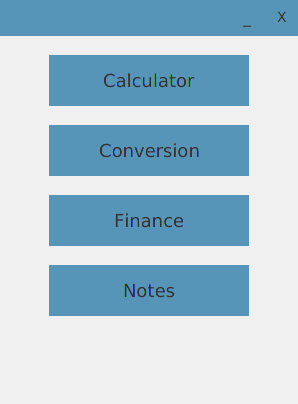
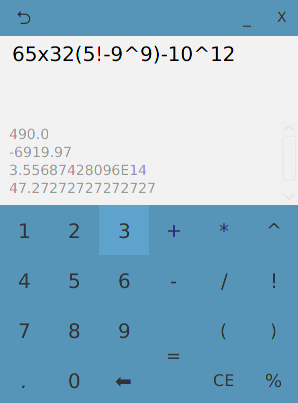
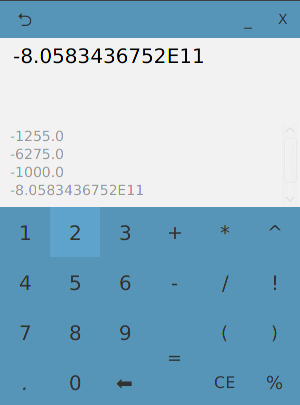
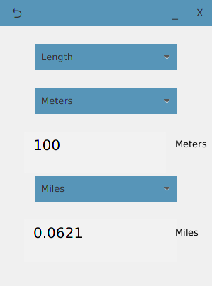
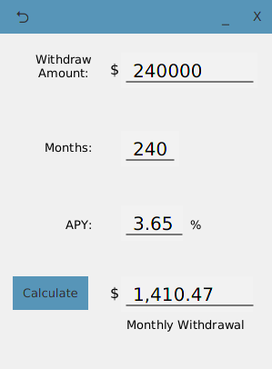

# ToolKit
ToolKit is a program that provides calculators for complex expressions, conversions, and finances.

## Menu

  

## Calculator
Solve complex expressions like the one shown below.

  

  

## Conversions
Convert currencies, lengths, weights, and volumes.

  

## Finance
Calculate loans, withdrawals, and future 401K balances.

  

  

## Notes
Create, overwrite, and delete notes.

  

## Calculations and notes are saved automatically after the program is closed.

#### (Linux only) If unable to open ToolKit.jar by double clicking, go to the directory that has the jar file and run this command: java -jar ToolKit.jar 
